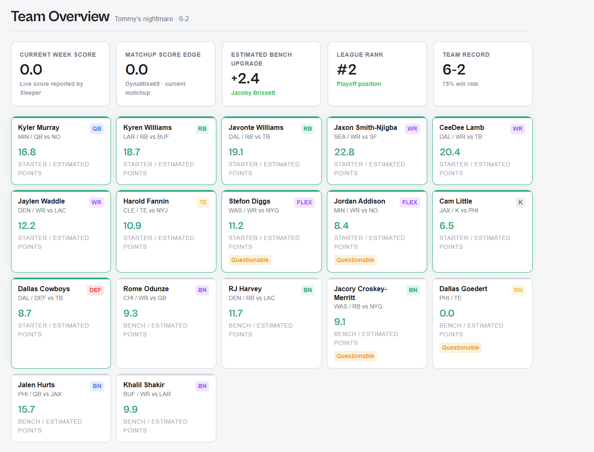
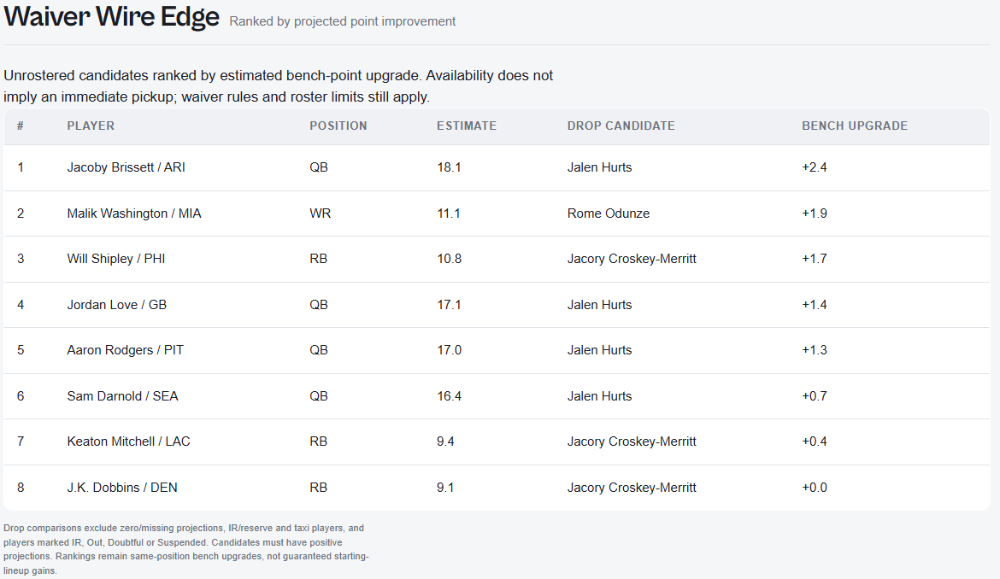
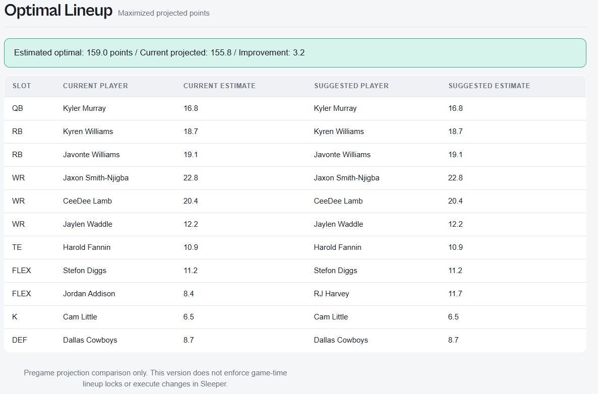
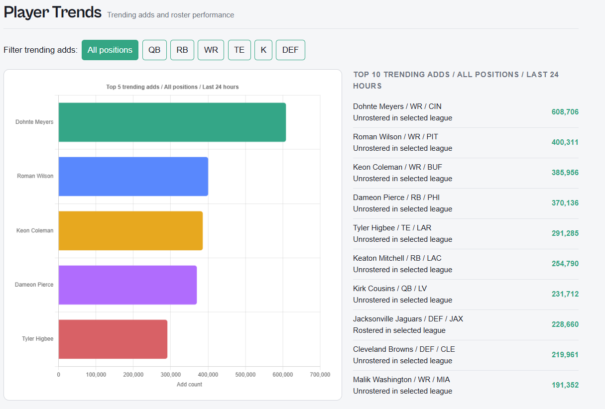
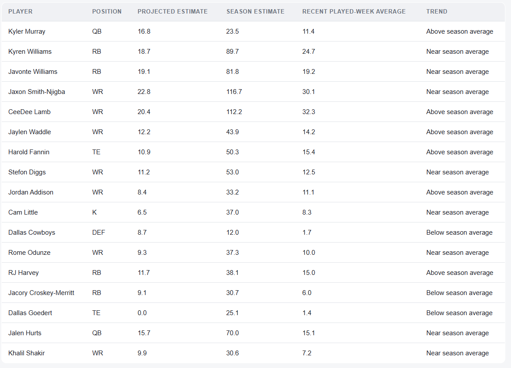
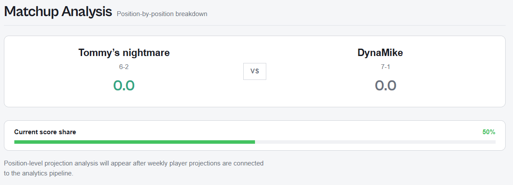

<div align="center">

# FF Pipeline

### Automated Fantasy Football Analytics

A Sleeper-connected analytics dashboard for smarter waiver decisions, optimized lineups, and player-trend discovery.

Python · Flask · JavaScript · Chart.js · GitHub Actions · GitHub Pages · Render

[Dashboard Preview](#dashboard-preview) · [How It Works](#how-it-works) · [Quick Start](#quick-start) · [Methodology](#analysis-methodology)

</div>

---



## Overview

FF Pipeline turns public Sleeper league data into an interactive fantasy football dashboard. Enter a username, choose a season and league, and select a team to explore projected player value, lineup opportunities, waiver candidates, and league-wide add activity.

The project combines a scheduled Python pipeline with a Flask API and browser-side analytics. GitHub Actions refreshes the pipeline output and deploys the website, while the interactive dashboard requests data for each visitor's selected league.

No Sleeper password is required. The application reads public data and does not execute transactions or change lineups.

## What It Does

| Question | Dashboard Feature |
|:---------|:------------------|
| Who could improve my bench? | Waiver candidates ranked by estimated projected-point upgrades over eligible comparable bench players. |
| What is my highest-projected lineup? | Slot-aware optimization using the selected league's actual starting requirements. |
| Which players are being added most? | A top-five add-count chart and top-ten list with a shared position filter. |
| How are my players performing? | Weekly projections, season estimates, recent averages, and player-trend labels. |
| Where does my team stand? | Current matchup scores, team records, and league standings. |

---

## Dashboard Preview

### Team Overview

Player-level detail and league context in one view.

- KPI cards for current score, matchup score edge, estimated bench upgrade, league rank, and team record.
- Player cards with names, NFL teams, positions, opponents, and injury status.
- Clear starter-slot and bench labels, including multiple WR and FLEX slots.
- Projected player estimates kept separate from current live scores.


### Waiver Wire Edge

Find projected bench upgrades without letting a zero-point IR player distort the comparison.

- Identifies unrostered candidates eligible for the selected league's supported slots.
- Compares each candidate with an eligible same-position bench player.
- Excludes zero or missing projections, reserve/IR and taxi players, and unavailable statuses from drop comparisons.
- Shows up to 15 positive upgrades with player estimates and suggested drop candidates.



> Recommendations measure estimated bench-value improvement, not guaranteed starting-lineup gains. Unrostered players may still be subject to waiver processing and roster restrictions.

### Optimal Lineup

A lineup comparison built around your league—not a fixed standard template.

- Uses the selected league's actual starter slots.
- Supports multiple WR and FLEX slots, along with supported superflex and other flex formats.
- Assigns each eligible player at most once using dynamic programming.
- Displays current and suggested lineups, projected totals, and estimated improvement.



> Pregame comparison only. The application does not enforce game-time locks or submit lineup changes to Sleeper.

### Player Trends

Discover the most-added players, then narrow the view by position.

- Top-five horizontal bar chart ranked by last-24-hour add counts.
- Top-ten activity list with comma-formatted counts and roster availability labels.
- One shared position filter updates both panels.
- All positions selected by default; rankings include both rostered and unrostered players.



#### Roster Performance

A separate table tracks your players' weekly projected estimates, season estimates, recent played-week averages, and trends relative to their season averages.



### Matchup Analysis

View the current matchup, both team records, live scores, and current score share.



> Current score share is not a modeled win probability. Projected position-by-position matchup analysis remains a planned enhancement in the live dashboard.

### League Standings

League-wide records, win percentages, points for and against, and current-week scores—with the selected team highlighted.


<sub>Team names in this standings image are fictional replacements. Numeric values and the layout are preserved from the original screenshot.</sub>

---

## How It Works

```text
                          INTERACTIVE DASHBOARD

     Sleeper username → Season → League → Team selection
                                │
                                ▼
                    GitHub Pages · HTML / CSS / JS
                                │
                 ┌──────────────┴──────────────┐
                 ▼                             ▼
          Render · Flask API            Sleeper data feeds
          League and roster data        Player metadata
          Standings and matchups        Projections and statistics
                                        Trending adds
                 │                             │
                 └──────────────┬──────────────┘
                                ▼
                      Browser-side analytics
                  Waiver comparisons · Lineup optimizer
                   Roster metrics · Chart.js visualizations

                         SCHEDULED PIPELINE

       GitHub Actions → Fetch → Transform → Analyze → JSON
                                │
                                ▼
                      Tests → GitHub Pages deploy
```

### Engineering Highlights

| Area | Implementation |
|:-----|:---------------|
| Data integration | Combines league, roster, player, projection, statistics, and trending feeds. |
| Data normalization | Resolves player IDs and selects one source record per player using provider priority and timestamps. |
| Decision logic | Filters invalid waiver comparisons and optimizes distinct player assignments under slot constraints. |
| Interactive reporting | Shared position controls keep chart and list rankings synchronized. |
| Automation | Scheduled and manually triggered Python runs with tests and Pages deployment. |
| Transparency | Labels estimates, explains scoring assumptions, and reports unavailable results. |

<details>
<summary>View the project structure</summary>

```text
Fantasy-Football-Analyzer/
├── .github/workflows/refresh.yml  # Refresh, tests, and Pages deployment
├── backend/
│   ├── app.py                    # Flask league and matchup API
│   ├── requirements.txt
│   └── Procfile
├── src/
│   ├── config.py                 # Python configuration
│   ├── main.py                   # Pipeline orchestrator
│   ├── api/sleeper_client.py      # Sleeper client
│   ├── pipeline/
│   │   ├── fetch.py
│   │   ├── transform.py
│   │   └── analyze.py
│   └── dashboard/generate_demo.py
├── data/
│   ├── demo/league_data.json
│   └── snapshots/
├── docs/
│   ├── index.html
│   ├── data.json                 # Python pipeline output
│   └── assets/
│       ├── styles.css
│       └── app.js                # Dashboard and live analytics
├── tests/
│   ├── test_analyze.py
│   └── fixtures/sample_data.py
├── screenshots/
├── requirements.txt
├── .env.example
└── README.md
```

</details>

---

## Quick Start

### Preview the Live Dashboard

Clone the repository, or download and extract it from GitHub:

```bash
git clone https://github.com/MichaelWhitney-Analytics/Fantasy-Football-Analyzer.git
cd Fantasy-Football-Analyzer
```

Start the local website from the project root:

```bash
python -m http.server 8000 --directory docs
```

Open `http://localhost:8000`, enter your Sleeper username, and select your league and team. Leave the server running while testing.

The current frontend uses the hosted Render API and direct Sleeper requests, so internet access is required. A local Flask server is not required for this preview.

<details>
<summary>Run the separate Python pipeline and test suite</summary>

Install dependencies and generate demo output:

```bash
pip install -r requirements.txt
python -m src.dashboard.generate_demo
python -m src.main --demo
```

These commands write pipeline output to `docs/data.json`. The connection-first dashboard does not automatically render this file as a demo view; its live analytics use the visitor's selected league.

For live Python execution, copy `.env.example` to `.env`, configure the username, league ID, and season, then run:

```bash
python -m src.main --live
```

Run fixture-based Python tests:

```bash
python -m pytest tests/ -v
```

These tests cover the Python analysis engine, not the newer browser-side analytics. Do not commit `.env` or credentials.

</details>

<details>
<summary>Deployment and automation settings</summary>

The current Render service uses:

```text
Root Directory: backend
Build Command: pip install -r requirements.txt
Start Command: gunicorn app:app
```

GitHub Actions runs on Tuesday, Thursday, and Sunday at `15:00 UTC`, and supports manual dispatch. These are fixed UTC schedules. Thursday's run is not an after-Thursday-Night-Football refresh.

The workflow:

1. Generates demo fixtures.
2. Runs live Python mode when the `SLEEPER_LEAGUE_ID` Actions secret is configured; otherwise uses demo mode.
3. Runs the Python test suite.
4. Commits generated JSON.
5. Publishes `docs` to the `gh-pages` branch.

Configure GitHub Pages to publish from `gh-pages`. For immediate deployment after a website update, manually run “Fantasy Football Data Refresh” from Actions; the supplied workflow has no push trigger.

Interactive league analytics are requested when a visitor connects. They are separate from the scheduled Python output.

</details>

---

## Analysis Methodology

### Projected Estimates

The live dashboard retrieves selected-week projection records and calculates an additive estimate using the selected league's scoring weights:

```text
estimated_points = Σ (returned_stat × matching_league_scoring_weight)
```

Records are deduplicated by player. Rotowire is preferred for projections and Sportradar for statistics; within equal provider priority, the newer timestamp wins.

### Waiver Ranking

```text
bench_upgrade = candidate_projected_estimate
              − comparable_bench_projected_estimate
```

Only positive upgrades are ranked. Drop candidates must have positive projections and pass reserve/status exclusions. The live calculation does not add popularity or bye-coverage bonuses.

### Lineup Optimization

Dynamic programming evaluates distinct player-to-slot assignments to find the highest projected total for supported league slots. Missing projections and unavailable statuses can prevent a complete recommendation.

<details>
<summary>Scoring assumptions and current limitations</summary>

- Estimates are not guaranteed to equal official Sleeper fantasy scores. Nonlinear bonuses, scoring tiers, unsupported stat mappings, and aggregate projections can produce differences.
- Missing statistic keys contribute zero; missing player records remain unavailable. Unmatched configured scoring keys are reported in the dashboard.
- Recent averages use available records from the preceding three weeks, excluding missing weekly records. Trend labels use a ±15% comparison against estimated season points per returned game played.
- The optimizer supports up to 16 starter slots: `QB`, `RB`, `WR`, `TE`, `K`, `DEF`, `FLEX`, `SUPER_FLEX`, `REC_FLEX`, and `WRRB_FLEX`. It does not enforce game-time locks. Explicit reserve/taxi exclusions currently apply to waiver comparisons; optimizer eligibility uses player status and projection availability.
- Trending rankings use returned source records. The application requests up to 1,000 entries; filtered positions may have fewer than ten players.
- Standings currently use win percentage followed by points for. The top-six playoff display is a frontend convention, not yet derived from league playoff settings.
- Browser-side live logic and Python pipeline logic are separate implementations. Existing Python tests do not validate the browser calculations.
- Very small positive waiver upgrades can display as `+0.0` when rounded to one decimal place.
- Projection/statistics feeds are external dependencies; their availability and schema are not guaranteed.

</details>

---

## Tech Stack

| Layer | Technology | Role |
|:------|:-----------|:-----|
| Pipeline | Python | Fetching, transformation, analysis, and JSON output |
| API | Flask · Flask-CORS · Gunicorn | League, standings, and matchup responses |
| Frontend | HTML · CSS · JavaScript · Tailwind CSS | Interactive dashboard and live calculations |
| Visualization | Chart.js | Trending-add bar chart |
| Automation | GitHub Actions | Scheduled refreshes, tests, and deployment |
| Hosting | GitHub Pages · Render | Static website and backend service |
| Testing | pytest | Fixture-based Python analysis tests |
| Design | Lucide · Fontshare | Icons and typography |

## Next Improvements

- Projected position-by-position matchup comparisons.
- Official-score parity validation for bonuses and scoring tiers.
- League-specific playoff cutoffs and tiebreakers.
- Browser-side automated tests and lineup-lock awareness.
- Consolidated frontend logic and shared backend feed caching.

---

<div align="center">

Built to demonstrate API integration, data transformation, analytical modeling, automation, and interactive reporting through a practical fantasy football application.

</div>
