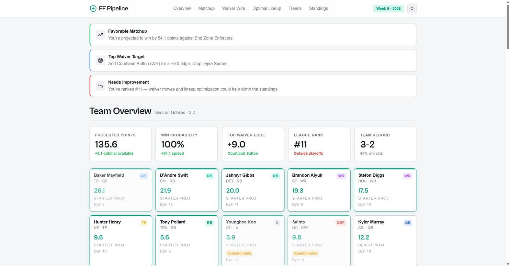
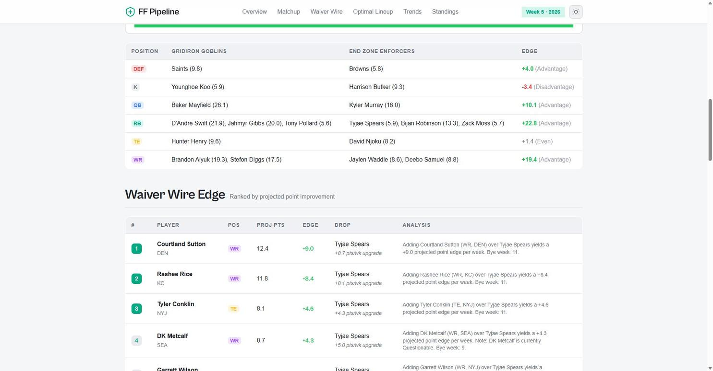
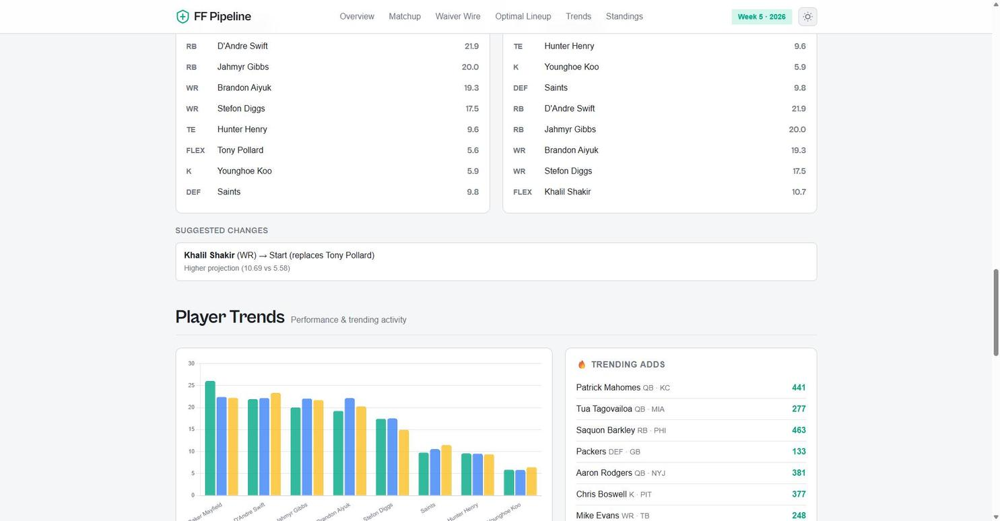
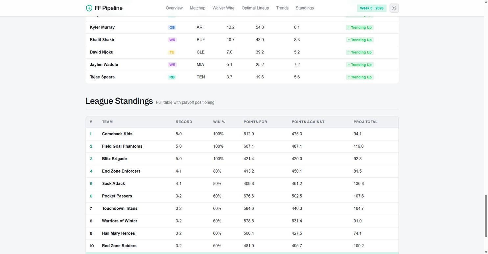
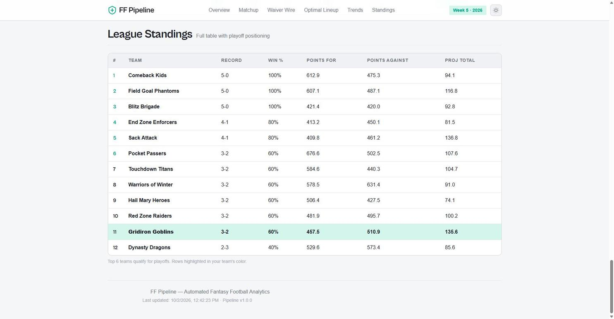

# FF Pipeline — Automated Fantasy Football Analytics

An end-to-end data pipeline that pulls live fantasy football data from the Sleeper API, runs analytical models for waiver wire edge detection, matchup analysis, and lineup optimization, and publishes a professional dashboard — all on an automated weekly schedule.



## What It Does

FF Pipeline connects to your live Sleeper fantasy football league and answers three questions every week:

1. **Who should I add from the waiver wire?** — Ranks available free agents by projected point improvement over your weakest bench player, factoring in bye week coverage, injury status, and trending activity.
2. **How does my team match up this week?** — Compares your projected starting lineup against your opponent's, position by position, with a calculated win probability.
3. **What's my optimal lineup?** — Solves for the highest projected point combination within your roster slots, accounting for byes and injuries, and suggests specific changes from your current lineup.

The pipeline runs automatically via GitHub Actions three times per week during the NFL season (Tuesday after MNF, Thursday after TNF, Sunday morning before games), pulls fresh data, recomputes all analysis, and deploys an updated dashboard to GitHub Pages.

---

## Dashboard Preview

### Team Overview


KPI cards show projected points, win probability, top waiver edge, league rank, and team record. Roster cards display starters (highlighted) and bench with projections, injury status, and bye weeks.

### Matchup Analysis


Side-by-side comparison of your projected lineup vs your opponent's. Position-by-position edge indicators show advantages (green) and disadvantages (red). Win probability bar visualizes your chances.

### Waiver Wire Edge


Ranked table of the top free agent pickups. Each recommendation includes the player, projected points, calculated edge value, a drop suggestion with reasoning, and a detailed analysis string. Trending players are highlighted.

### Optimal Lineup


Current vs optimal lineup comparison. Shows the projected point improvement and lists specific suggested changes with reasoning (e.g., "Khalil Shakir (WR) → Start, replaces Tony Pollard — Higher projection").

### Player Trends


Bar chart comparing projected points, season average, and recent form for your starters. Trending adds across the league are listed alongside. Full trends table shows hot/cold/stable indicators for your entire roster.

### League Standings


Full league table with records, win percentage, points for/against, and projected totals. Playoff cutoff highlighted. Your team row is highlighted.

---

## Architecture

```
┌─────────────────────────────────────────────────────────────┐
│                    GITHUB ACTIONS (Cron)                     │
│  Tuesday 8AM MT │ Thursday 8AM MT │ Sunday 8AM MT            │
└──────────────────────────┬──────────────────────────────────┘
                           │
                           ▼
┌──────────────┐    ┌─────────────────┐    ┌──────────────────┐
│   fetch.py   │───▶│  transform.py   │───▶│   analyze.py     │
│  Sleeper API │    │  Clean & enrich │    │  Edge analysis   │
│  Read-only   │    │  Normalize data │    │  Matchup         │
│  No auth     │    │  Build rosters  │    │  Lineup opt.     │
└──────────────┘    └─────────────────┘    └────────┬─────────┘
                                                   │
                                                   ▼
                                          ┌──────────────────┐
                                          │   docs/data.json │
                                          │  Dashboard data   │
                                          └────────┬─────────┘
                                                   │
                                                   ▼
                                          ┌──────────────────┐
                                          │  GitHub Pages     │
                                          │  Static HTML/CSS  │
                                          │  Tailwind + JS    │
                                          └──────────────────┘
```

### Data Flow

1. **Fetch** — Python script calls the Sleeper API (free, no auth) to pull league settings, all rosters, weekly matchups, the full NFL player database (~5MB, cached), trending adds/drops, and recent transactions.
2. **Transform** — Raw API responses are cleaned and enriched: player IDs mapped to names/positions/teams, rosters structured with starter/bench separation, available free agents identified (all players minus rostered), standings computed.
3. **Analyze** — Three analysis modules run on the cleaned data:
   - **Waiver Edge**: Compares each free agent against your weakest comparable bench player, applies modifiers for trending activity, bye week coverage, and injury status, ranks by adjusted edge value.
   - **Matchup Analysis**: Position-by-position comparison with win probability calculated via logistic function on projected point differential.
   - **Lineup Optimizer**: Greedy assignment of best players to roster slots, maximizing projected points while accounting for byes and injuries.
4. **Dashboard** — Analysis results written as JSON, consumed by a static HTML dashboard (Tailwind CSS + Chart.js), deployed to GitHub Pages.

---

## Project Structure

```
fantasy-football-pipeline/
├── .github/
│   └── workflows/
│       └── refresh.yml          # GitHub Actions: cron schedule + deploy
├── src/
│   ├── __init__.py
│   ├── config.py                # Configuration (env vars, paths, settings)
│   ├── main.py                  # Pipeline orchestrator
│   ├── api/
│   │   ├── __init__.py
│   │   └── sleeper_client.py    # Sleeper API wrapper (all endpoints)
│   ├── pipeline/
│   │   ├── __init__.py
│   │   ├── fetch.py              # Data collection (live + demo modes)
│   │   ├── transform.py         # Data cleaning & enrichment
│   │   └── analyze.py            # Analysis engine (waiver, matchup, lineup)
│   └── dashboard/
│       ├── __init__.py
│       └── generate_demo.py     # Demo data generator (realistic fixtures)
├── data/
│   ├── demo/
│   │   └── league_data.json     # Demo fixture data
│   └── snapshots/               # Historical snapshots (auto-generated)
├── docs/
│   ├── index.html                # Dashboard (static HTML)
│   ├── data.json                 # Pipeline output (auto-generated)
│   └── assets/
│       ├── styles.css            # Dashboard styles (design system)
│       └── app.js                # Dashboard rendering logic
├── tests/
│   ├── __init__.py
│   ├── test_analyze.py           # 18 unit tests for analysis engine
│   └── fixtures/
│       ├── __init__.py
│       └── sample_data.py         # Test fixtures
├── screenshots/                  # Dashboard screenshots for README
├── requirements.txt              # Python dependencies
├── .gitignore
├── .env.example                  # Environment variable template
└── README.md
```

---

## Quick Start

### Prerequisites

- Python 3.10+
- A GitHub account (for Actions + Pages)
- A Sleeper fantasy football league (optional — demo mode works without one)

### 1. Clone the Repository

```bash
git clone https://github.com/yourusername/fantasy-football-pipeline.git
cd fantasy-football-pipeline
```

### 2. Install Dependencies

```bash
pip install -r requirements.txt
```

### 3. Run in Demo Mode

Demo mode uses realistic fixture data — no league ID or API calls required:

```bash
# Generate demo data
python -m src.dashboard.generate_demo

# Run the pipeline
python -m src.main --demo
```

This creates `docs/data.json` with the analysis output.

### 4. Preview the Dashboard

Open `docs/index.html` in your browser, or serve locally:

```bash
# Using Python's built-in server
cd docs && python -m http.server 8000
```

Visit `http://localhost:8000` to see the dashboard.

### 5. Connect Your Live League (Optional)

To use your actual Sleeper league data:

1. Find your Sleeper username and league ID:
   - Open your league on [sleeper.com](https://sleeper.com)
   - The URL contains your league ID: `sleeper.com/leagues/1234567890123456789`
   - Your username is what you log in with

2. Copy the environment template:
   ```bash
   cp .env.example .env
   ```

3. Edit `.env` with your details:
   ```bash
   SLEEPER_USERNAME=your_username
   SLEEPER_LEAGUE_ID=1234567890123456789
   DEMO_MODE=false
   ```

4. Run the pipeline:
   ```bash
   python -m src.main --live
   ```

The Sleeper API is free and requires no authentication — just your league ID. See the [Sleeper API docs](https://docs.sleeper.app).

---

## GitHub Actions Setup

The pipeline is configured to run automatically via GitHub Actions. To enable it:

1. Push the repository to GitHub
2. Go to **Settings > Pages** and set the source to the `gh-pages` branch
3. The workflow will run on the following schedule:
   - **Tuesday 8 AM MT** — After Monday Night Football
   - **Thursday 8 AM MT** — After Thursday Night Football
   - **Sunday 8 AM MT** — Before Sunday games

You can also trigger it manually from the **Actions** tab in GitHub (click "Run workflow").

### Workflow Configuration

The workflow (`.github/workflows/refresh.yml`) does the following:
1. Checks out the repository
2. Sets up Python 3.12
3. Installs dependencies
4. Generates demo data and runs the pipeline
5. Runs the test suite
6. Commits updated data back to the repo
7. Deploys the dashboard to GitHub Pages

To use live data in CI, add your league ID as a repository secret:
- **Settings > Secrets and Variables > Actions > New repository secret**
- Name: `SLEEPER_LEAGUE_ID`
- Value: your league ID

Then update the workflow to use `--live` instead of `--demo`.

---

## Analysis Methodology

### Waiver Wire Edge Calculation

The edge value for each available free agent is calculated as:

```
edge = free_agent_projected_points - weakest_bench_player_projected_points
       + trend_bonus (0.5 if trending)
       + bye_week_coverage_bonus (0.3 if covers different bye week)
       - injury_penalty (1.0 if injured)
```

Only recommendations with an edge above the threshold (default: 1.5 points) are shown. For FLEX-eligible positions (RB, WR, TE), the analysis compares across all three positions since they compete for the same roster slots.

### Win Probability

Win probability is calculated using a logistic (sigmoid) function on the projected point differential:

```
win_prob = 1 / (1 + e^(-diff / 5))
```

Where `diff` is your projected points minus your opponent's projected points. The divisor of 5 means a 5-point advantage gives ~73% win probability, and a 10-point advantage gives ~88%.

### Optimal Lineup Optimizer

The optimizer uses a greedy approach:
1. For each required position (QB, TE, K, DEF), select the highest-projected eligible player
2. Assign 2 RBs and 2 WRs (highest projections)
3. Assign FLEX to the best remaining RB/WR/TE
4. Filter out players on bye week or with serious injuries (IR, Out, Doubtful)
5. Compare against current lineup and suggest changes

---

## Tech Stack

| Component | Technology | Purpose |
|-----------|-----------|---------|
| **Language** | Python 3.10+ | Pipeline logic, API client, analysis engine |
| **Data Source** | Sleeper API | Free, read-only, no auth fantasy football data |
| **Scheduling** | GitHub Actions | Cron-based automation, 3x weekly |
| **Dashboard** | HTML5 + Tailwind CSS | Static, responsive, professional design |
| **Charts** | Chart.js | Bar charts for player trends |
| **Icons** | Lucide | Clean, consistent icon set |
| **Fonts** | Cabinet Grotesk + Satoshi | Via Fontshare CDN |
| **Hosting** | GitHub Pages | Free static site hosting |
| **Testing** | pytest | 18 unit tests for analysis engine |
| **Data Format** | JSON | Lightweight, portable, no database needed |

---

## Sleeper API Reference

The pipeline uses these Sleeper API endpoints ([docs](https://docs.sleeper.app)):

| Endpoint | Purpose |
|----------|---------|
| `GET /v1/state/nfl` | Current NFL season, week, and season type |
| `GET /v1/user/<username>` | Resolve username to user ID |
| `GET /v1/user/<user_id>/leagues/nfl/<season>` | All leagues for a user |
| `GET /v1/league/<league_id>` | League settings, scoring, roster positions |
| `GET /v1/league/<league_id>/rosters` | All rosters (players, starters, records) |
| `GET /v1/league/<league_id>/users` | Manager display names and avatars |
| `GET /v1/league/<league_id>/matchups/<week>` | Weekly matchups |
| `GET /v1/league/<league_id>/transactions/<round>` | Waivers, trades, free agent adds |
| `GET /v1/players/nfl` | Full NFL player database (~5MB, cached) |
| `GET /v1/players/nfl/trending/<add\|drop>` | Trending adds/drops across platform |

Rate limit: Stay under 1,000 calls/minute. The client includes built-in rate limiting.

---

## Running Tests

```bash
python -m pytest tests/ -v
```

Tests cover:
- Waiver edge ranking, filtering, and trend bonus
- Matchup analysis structure and win probability range
- Lineup optimizer output and change suggestions
- Helper functions (comparable positions, drop reasons)
- Player trend labels
- Insights generation

---

## Configuration

All settings are controlled via environment variables (see `.env.example`):

| Variable | Default | Description |
|----------|---------|-------------|
| `SLEEPER_USERNAME` | (empty) | Your Sleeper username |
| `SLEEPER_LEAGUE_ID` | (empty) | Your league ID from the Sleeper URL |
| `NFL_SEASON` | `2026` | Season year |
| `SCORING_TYPE` | `ppr` | Scoring format (ppr, half, standard) |
| `DEMO_MODE` | `true` | Use demo data instead of live API |
| `SANITIZE_OUTPUT` | `true` | Sanitize names for public display |

---

## License

MIT — Feel free to use this project for your own league, portfolio, or learning.

---

## Acknowledgements

- [Sleeper API](https://docs.sleeper.app) — Free, read-only fantasy football API
- [Chart.js](https://www.chartjs.org) — Simple, flexible charting
- [Tailwind CSS](https://tailwindcss.com) — Utility-first CSS framework
- [Fontshare](https://www.fontshare.com) — Cabinet Grotesk and Satoshi fonts
- [Lucide](https://lucide.dev) — Open-source icon library
